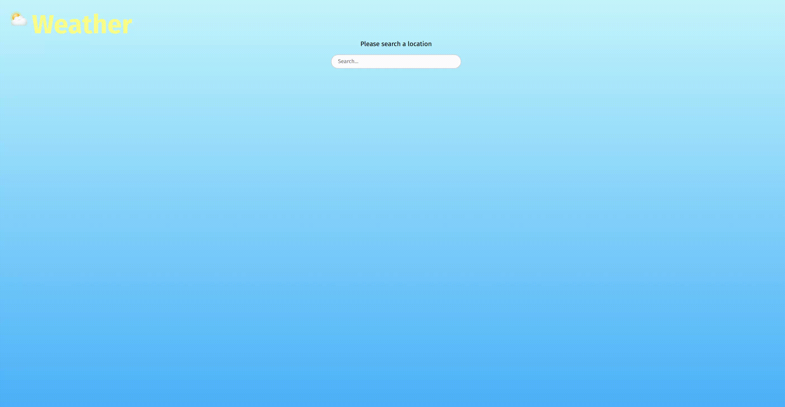

# 🌤️ Weather Web App

A minimal, vanilla JavaScript weather app. Search any city and see its **current temperature** and **wind speed** at a glance — no frameworks, no build step, no API key.

## ✨ Features

- 🔍 City search via Open-Meteo *Geocoding* API
- 🌡️ Current temperature · 💨 current wind speed
- ⌨️ Triggered by **Enter** or by leaving the search field
- 🎨 Clean responsive UI with a soft sky-gradient theme
- 🧩 Clear 3-layer architecture: data / rendering / orchestration
- 🔒 No accounts, no API keys, 100% client-side

## 🧱 Tech Stack

- **HTML5 + CSS3** — custom properties, flexbox
- **Vanilla JavaScript** — ES modules, `async`/`await`, `fetch`
- **[Open-Meteo API](https://open-meteo.com/)** — free weather & geocoding, no key required

## 📁 Project Structure

```
Weather-app/
├── index.html          → the skeleton (the structure)
├── style.css           → the presentation (the look)
├── scripts/
│   ├── api.js          → data layer (talks only to Open-Meteo)
│   ├── render.js       → UI layer (writes only to the DOM)
│   └── app.js          → orchestration (state + event listeners, glues the two)
└── assets/             → SVG icons
```

## ⚙️ How It Works

1. You type a city and press **Enter** (or leave the search field).
2. `api.js` asks Open-Meteo *Geocoding* for the city's coordinates.
3. `api.js` asks Open-Meteo *Forecast* for the *current* weather at those coordinates.
4. `render.js` builds the result card, `app.js` fills in temperature & wind.
5. The card appears.

The forecast request pulls the `current` block of the API for real-time values:

```
https://api.open-meteo.com/v1/forecast?latitude=..&longitude=..&current=temperature_2m,relative_humidity_2m,wind_speed_10m,wind_direction_10m
```

## Video Demo



## 📄 License

Made by Daniele. Free to use, modify and share. 🚀